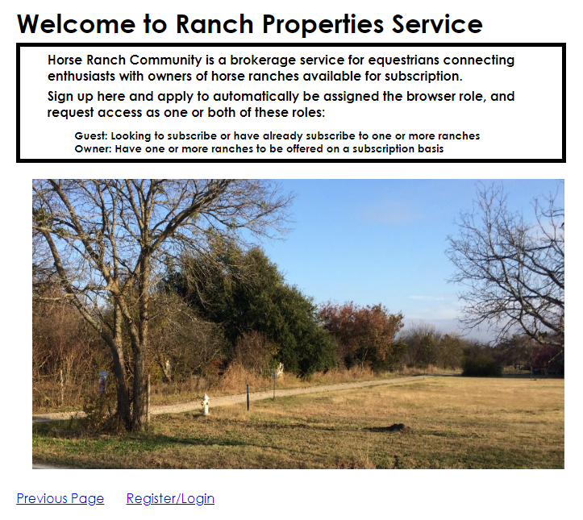
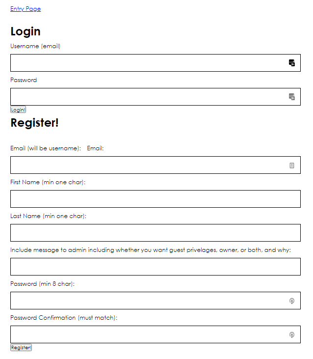
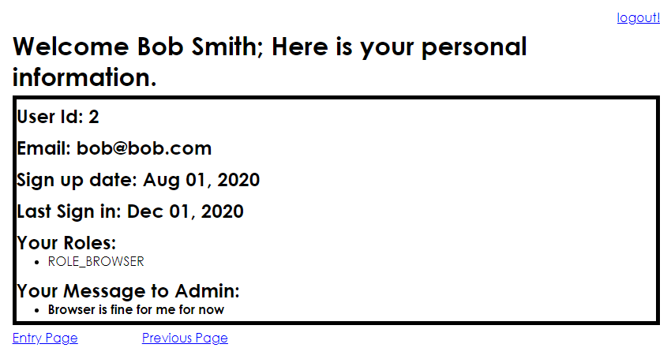
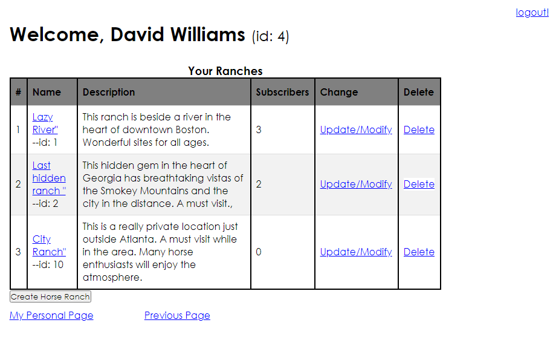
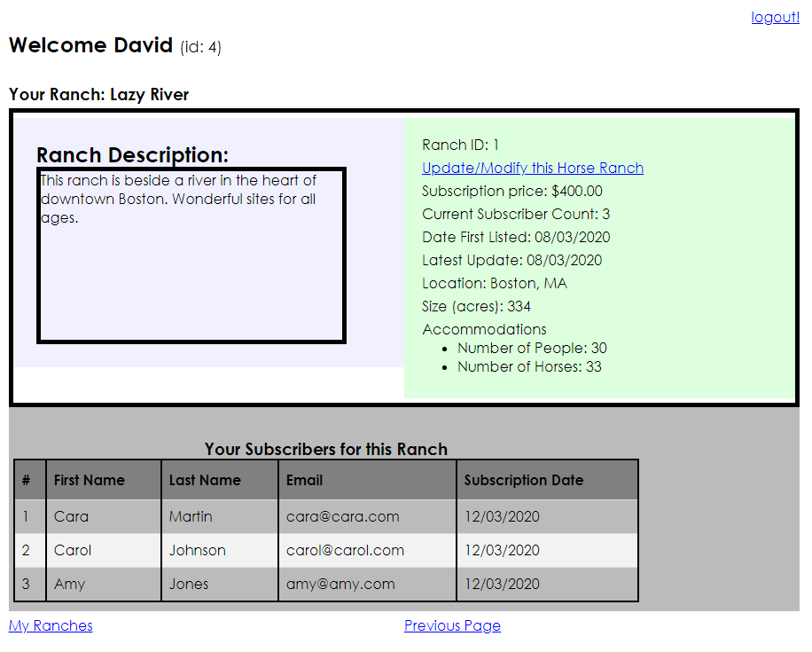
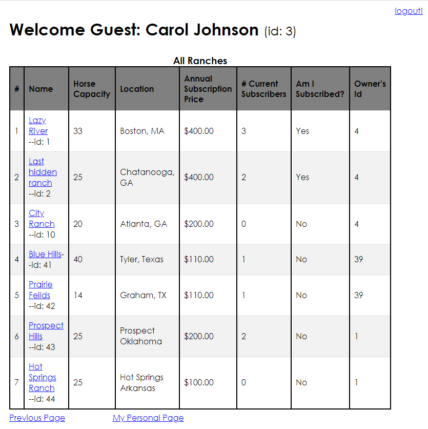
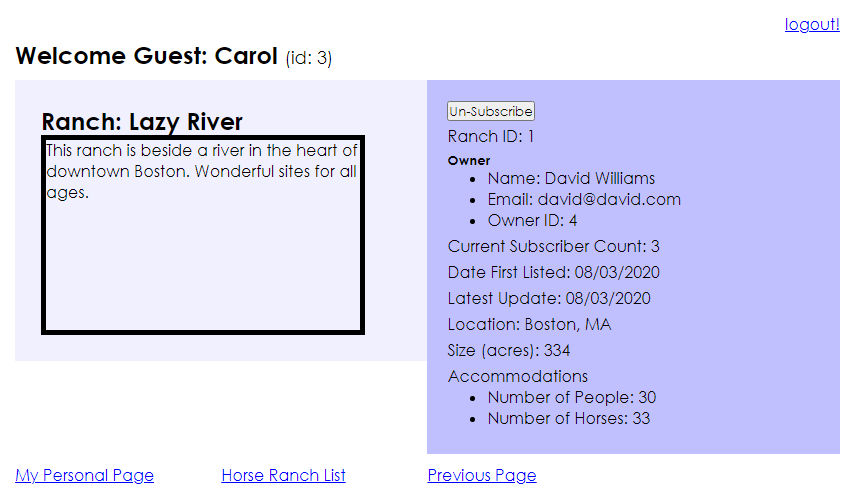
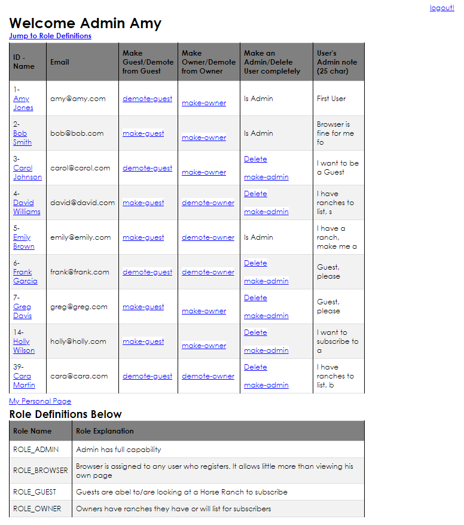

# User Documentation

Products and Customers is a simple web application that manages the products a vendor or distributor has under use by customers, and also manages the customers using those products

# Getting Started

The entry page has a bit of introduction, but the real starting point is to register.

When registering you will be asked to indicate whether you want to be an owner, guest, or both

# Screenshots with explanations

  * Expected first page for new users
  * Just click Register/Login to join up

  

&nbsp;

  * Registered users just need their email address and password to login

  

  
&nbsp;

  * All users can see their site information here
  * Except for Admins, successful login directs to this page

  
  
&nbsp;

  
  * Owners can start here by listing their properties
  * Also shows all their properties for inspection or modification

  
  
&nbsp;

  * Owner can see details on each ranch

 

  
&nbsp;

  * Intended for guests, this page shows all ranches for selection to drill down

 
  
&nbsp;

  * Details on a specific ranch
  * Can change subscription status

  
&nbsp;

  * Admin page for manage user accounts

  
  
&nbsp;

# For Owners...

## Business parameters:

  * Horse Ranch constraints on properties
    * Number of Acres
      * Minimum:  2; because less than that is not really enough for barn, horse arena, etc
      * Maximum:  100,000; because anything entered larger than that is very likely a mistake
    * Horse Capacity; number of horses that can be kept on property
      * Minimum:  2; because no fun riding alone
      * Maximum:  1,000; because anything larger is likely a mistake
    * People Capacity; number of subscriber people who can be accommodated at once...taking into account parking, etc.
      * Minimum:  2; because no fun riding alone
      * Maximum:  100; because anything larger is likely a mistake
    *  Subscription Price; should be rounded to whole dollars
      * Minimum $100; because anything less is not practical
      * Maximum $100,000; because even if 5 people stayed continuously for a year, that is an almost incredibly high price
    * Ranch Name Min/max
      * Minimum:  5 characters, no restriction on type
      * Maximum:  10 characters
    * Ranch Description; Should provide all the information a prospect should want before calling for more information
      * Minimum:  5 characters
      * Maximum:  250 characters
      

## Other Business notes:

* A single subscriber represents the payer and up to 4 guests for any visit.  More than four would require special permission

 
&nbsp;

# Answers to possible questions
* What if I need more help deciding about a ranch?

  * User owner information to email
  * Can I be an owner and guest?

  * Sure

    * If you really are considering subscribing, then you can be a guest
    * If you really have a ranch to list, you can be an owner 

  